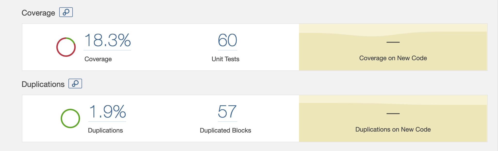
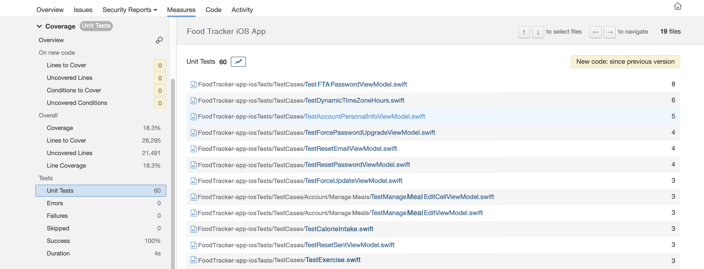

# forsis plugin

**Please Note:** Forsis has a new home. Please use its new [repository](https://github.com/Tumiya/forsis) to get the future updates and for opening issues and pull requests.

[](https://rubygems.org/gems/fastlane-plugin-forsis)
[](https://rubygems.org/gems/fastlane-plugin-forsis)
[](https://github.com/rubocop/rubocop)
[](https://github.com/azohra/forsis/actions/workflows/CI-workflow.yml?query=branch%3Amaster)


**forsis** is a [_fastlane_](https://github.com/fastlane/fastlane) plugin that will be helpful to those swift developers who use SonarQube to analyze their code. forsis uses JUnit test reports generated by fastlane to produce generic test execution reports supported by SonarQube.

If you have used SonarQube for analyzing Swift projects, you've probably noticed that other than the code coverage, you don't get any information related to the unit tests appearing on the project dashboard. This plugin, however, will help you get more visibility on the unit tests by generating a test report that can be analyzed by SonarQube. By sending such a test report to SonarQube, the total number of unit tests will be displayed on the project dashboard as shown in the following image.



In addidtion, you can see a breakdown of test results under project Measures > Coverage > Tests. Alternatively, you can select the test count on the dashbord (by clicking it) to see the test results as shown in the image below.



## Getting Started

 To get started with `fastlane-plugin-forsis`, add it to your project by running:

```bash
bundle exec fastlane add_plugin forsis
```
 Start using the plugin by adding this example 'lane' to your Fastfile:

 ```ruby
lane :sonarqube_test_report do
	forsis(
	    junit_report_file: './fastlane/report.junit',
	    sonar_report_directory: 'path_to_a_directory_to_store_sonarqube_report'
    )
end
 ```
 * `junit_report_file` is the path to the JUnit test report generated by fastlane
 * `sonar_report_directory` is the directory to store the generated SonarQube report. This parameter is optional and the defaut value is the fastlane directory in the main repo (*i.e.*, `./fastlane`).

**Note:** This plugin uses the fastlane JUnit test report named `report.junit`. This report is generated by running tests through fastlane using `run_tests` or `scan` actions. Therefore, in your Fastfile, the forsis lane must be run after the lane that runs the tests.  Including the test lane, your Fastfile would look like the example below.

```ruby
lane :run_unit_tests do
  run_tests(
      workspace: 'path_to_the_xcworkspace_directory',
      scheme: 'path_to_the_project_test_scheme',
      devices: ["iPhone 6s"],
      # output_types: 'junit',
      output_directory: './fastlane/test_output',
    )
end
    
lane :sonarqube_test_report do
	forsis(
	    junit_report_file: './fastlane/test_output/report.junit',
	    sonar_report_directory: './fastlane'
    )
end
```

The `run_tests` action generates a test report in two different formats by default (html and junit). (Note: the `scan` method is an alias for the `run_tests` method.) If you would not like to get the html report, you can override this default behavior by setting the parameter `output_types` to only 'junit'. In the example `:run_unit_tests` lane above, uncomment the line for output_types to only get a JUnit test report. Test reports are then found in the fastlane directory or in the `output_directory` if it has been set. To learn more about how to run tests through fastlane, check out the [fastlane documentation] (https://docs.fastlane.tools/getting-started/ios/running-tests/).

## How to use the SonarQube test report generated by forsis?
This plugin creates an XML test report called `Test_sonarqube_report.xml`. To get benefit from this report, you need to feed it to SonarQube properly. To do so, you need to set the two following SonarQube analysis parameters:

  * `sonar.tests` is the path to the directory that contains tests
  * `sonar.testExecutionReportPaths` is the path to the SonarQube test report file generated by the plugin *i.e.*, the value of the `sonar_report_directory` in the forsis action followed by the name of the XML file that contains the report. This would be `fastlane/Test_sonarqube_report.xml`, if sonar_report_directory was not set.

If you need help setting up analysis parameters for SonarQube, refer to the [SonarQube Analysis Parameters](https://docs.sonarqube.org/latest/analysis/analysis-parameters/) documentation.

## Troubleshooting

If you have trouble using plugins, check out the [Plugins Troubleshooting](https://docs.fastlane.tools/plugins/plugins-troubleshooting/) guide.

## About _fastlane_

_fastlane_ is the easiest way to automate beta deployments and releases for your iOS and Android apps. To learn more, check out [fastlane.tools](https://fastlane.tools).

## Contributing

Bug reports and suggestions for improvements are always welcome. PRs are even better!! 

If you run into any issues, before submitting a new GitHub issue, please make sure to

* Check out the entire README on this repo 
* Search for [existing GitHub issues](https://github.com/azohra/forsis/issues)

If the above doesn't help, please submit an issue on [GitHub](https://github.com/azohra/forsis/issues). When reporting a bug, please make sure to include a spec that highlights the bug.
  
## License

This software is available as open source under the terms of the MIT License.

